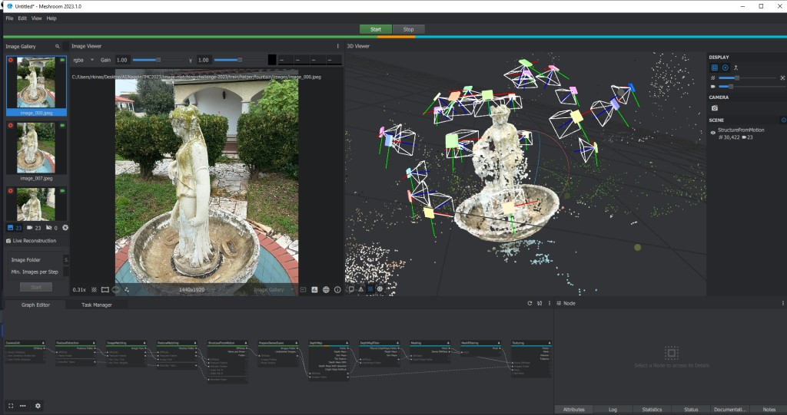

# 3D Scene Reconstruction with Deep Learning

This project implements an **end-to-end 3D reconstruction pipeline from images** by combining **deep learning–based feature extraction and matching** with **COLMAP’s geometry back-end**.

The classical SIFT-based front-end of COLMAP is replaced with a modern learned pipeline using **EfficientNet**, **SuperPoint**, and **SuperGlue**, while COLMAP is retained for **Structure-from-Motion (SfM)** and **Multi-View Stereo (MVS)**.

---

## 🚀 Overview

**Input:** Multiple RGB images of the *same object or scene* captured from different viewpoints
**Output:** Sparse and dense 3D reconstruction (camera poses + point cloud)

### High-level Pipeline

```
Images
  ↓
EfficientNet (global image similarity & pair selection)
  ↓
SuperPoint (learned keypoints + descriptors)
  ↓
SuperGlue (context-aware feature matching)
  ↓
Custom COLMAP database (SQLite)
  ↓
COLMAP SfM (camera poses + sparse points)
  ↓
COLMAP MVS (dense point cloud)
```

---

## 🖼️ Example Inputs & Reconstruction Results

Below is an example reconstruction produced using this pipeline on a **real-world object (garden statue)**.

### Input Images

The following images are overlapping views of the same object captured from different angles:


*Example input views used for reconstruction. All images belong to the same object and are taken sequentially around it.*

---

### Input Images (Sample)


---

### Dense Reconstruction (Multi-View Stereo)



*Dense point cloud (`fusion.ply`) generated by COLMAP MVS and visualized in MeshLab/Open3D.*

---

## 🧠 Deep Learning Front-End (Low-Level Explanation)

This project explicitly replaces COLMAP’s classical SIFT-based front-end with a **fully learned perception stack**. Below is a low-level breakdown of *what is learned*, *how it operates*, and *what exactly is passed to the geometric back-end*.

### 1. Global Representation Learning (EfficientNet-B0)

Each input image (I) is passed through a pretrained **EfficientNet-B0** convolutional backbone. Let F(I) ∈ R^{C×H×W} denote the final convolutional feature map. Global average pooling is applied to produce a compact embedding vector f(I) ∈ R^{C} capturing global semantic and structural information.

Pairwise cosine similarity between embeddings is computed to rank image pairs, and only the top-ranked pairs are forwarded to local feature matching, reducing unnecessary computation.

---

### 2. Learned Keypoint Detection & Description (SuperPoint)

SuperPoint is a fully convolutional neural network trained via **self-supervision using homographic adaptation**. Given an image, the network predicts a keypoint probability heatmap and a dense descriptor map. After non-maximum suppression, the model outputs pixel-level keypoints and corresponding 256-dimensional descriptors.

Unlike SIFT, SuperPoint learns invariances to illumination and viewpoint directly from data and does not rely on hand-crafted gradient histograms.

---

### 3. Context-Aware Feature Matching (SuperGlue)

SuperGlue performs **learned matching** rather than nearest-neighbor descriptor matching. Keypoints from two images are treated as nodes in a graph and matched using attention-based message passing and a differentiable optimal transport formulation. This allows global consistency, rejection of ambiguous matches, and robustness in repetitive or low-texture regions.

---

### 4. Interface with Geometry (COLMAP)

The learned front-end outputs keypoints, descriptors, and index-based matches, which are written directly into COLMAP’s SQLite database. From this point onward, COLMAP performs purely geometric optimization, including camera pose estimation, triangulation, bundle adjustment, and multi-view stereo.

---

## ✨ Key Features

* 🔥 Deep learning–based front-end replacing SIFT
* 🧠 EfficientNet-B0 for global image similarity and pair pruning
* 📍 SuperPoint for learned keypoint detection and description
* 🔗 SuperGlue for attention-based feature matching
* 📐 COLMAP for robust geometric reconstruction
* 🗄️ Direct writing to COLMAP SQLite database

---

## 🧠 Deep Learning Front-End (Technical Details)

This pipeline replaces COLMAP’s classical feature pipeline with a **fully learned perception stack**, while leaving the geometric optimization unchanged.

### 1. Global Image Pair Selection (EfficientNet)

Each image is passed through a pretrained **EfficientNet-B0** backbone. The final convolutional features are globally average-pooled to produce a compact embedding vector. Pairwise **cosine similarity** is computed between embeddings, and only the top-K most similar image pairs are selected for local matching.

This step reduces the quadratic cost of exhaustive matching while preserving geometrically meaningful pairs.

---

### 2. Learned Keypoint Detection & Description (SuperPoint)

SuperPoint is a fully convolutional neural network trained via **self-supervision** (homographic adaptation). For each image, it predicts:

* A keypoint probability heatmap
* A dense descriptor map

After non-maximum suppression, the model outputs:

* Keypoints: (N \times 2) pixel coordinates
* Descriptors: (N \times 256) learned feature vectors

Unlike SIFT, SuperPoint does not rely on hand-crafted gradients or orientations and learns invariances directly from data.

---

### 3. Context-Aware Feature Matching (SuperGlue)

SuperGlue performs feature matching using a **graph neural network with cross-attention**. Keypoints from two images are treated as graph nodes, with edges formed via self- and cross-attention layers. Matching is solved using a differentiable **optimal transport (Sinkhorn)** formulation.

This allows SuperGlue to enforce global consistency, reject ambiguous matches, and outperform nearest-neighbor descriptor matching.

---

### 4. Integration with COLMAP

The learned front-end produces:

* Keypoints
* Descriptors
* Index-based feature matches

These are written directly into COLMAP’s SQLite database (`keypoints`, `descriptors`, `matches` tables). From this point onward, COLMAP performs standard geometric processing:

* Epipolar geometry estimation
* Camera pose recovery
* Triangulation
* Bundle adjustment
* Multi-view stereo

The learning-based models handle **perception and data association**, while COLMAP handles **geometry and optimization**.

---

## 📁 Project Structure

```
image3d/
├── datasets/
│   └── statue/
│       ├── image_001.jpg
│       ├── image_002.jpg
│       └── ...
│
├── models/
│   ├── efficientnet_selector.py
│   └── superpoint_superglue.py
│
├── utils/
│   └── colmap_db_writer.py
│
├── scripts/
│   ├── build_colmap_db.py
│   ├── insert_features.py
│   ├── insert_matches.py
│   └── run_colmap.py
│
├── assets/
│   ├── input_1.jpg
│   ├── input_2.jpg
│   ├── input_3.jpg
│   ├── input_4.jpg
│   ├── sparse_reconstruction.png
│   └── dense_reconstruction.png
│
├── output/
│   ├── database.db
│   ├── sparse/
│   └── dense/
│
└── README.md
```

---

## ▶️ Running the Pipeline

```bash
# Step 1: Create COLMAP database
python scripts/build_colmap_db.py --image_dir datasets/statue --db_path output/database.db

# Step 2: Insert SuperPoint features
python scripts/insert_features.py --image_dir datasets/statue --db_path output/database.db --device cuda

# Step 3: Insert SuperGlue matches
python scripts/insert_matches.py --image_dir datasets/statue --db_path output/database.db --pairs output/pairs.txt --device cuda

# Step 4: Run COLMAP SfM + MVS
python scripts/run_colmap.py
```

---

## 📤 Outputs

* `output/sparse/0/` – camera poses and sparse point cloud
* `output/dense/fusion.ply` – dense 3D reconstruction

The final point cloud can be visualized using **MeshLab** or **Open3D**.

---
## 📜 License

This project is intended for educational and research purposes. Third-party components retain their respective licenses.
